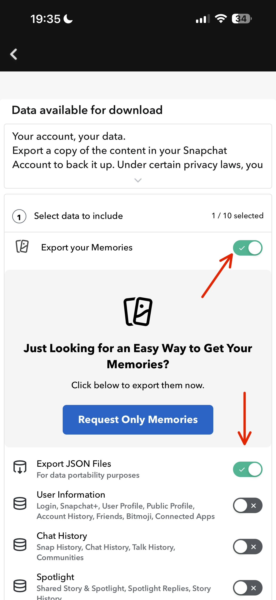
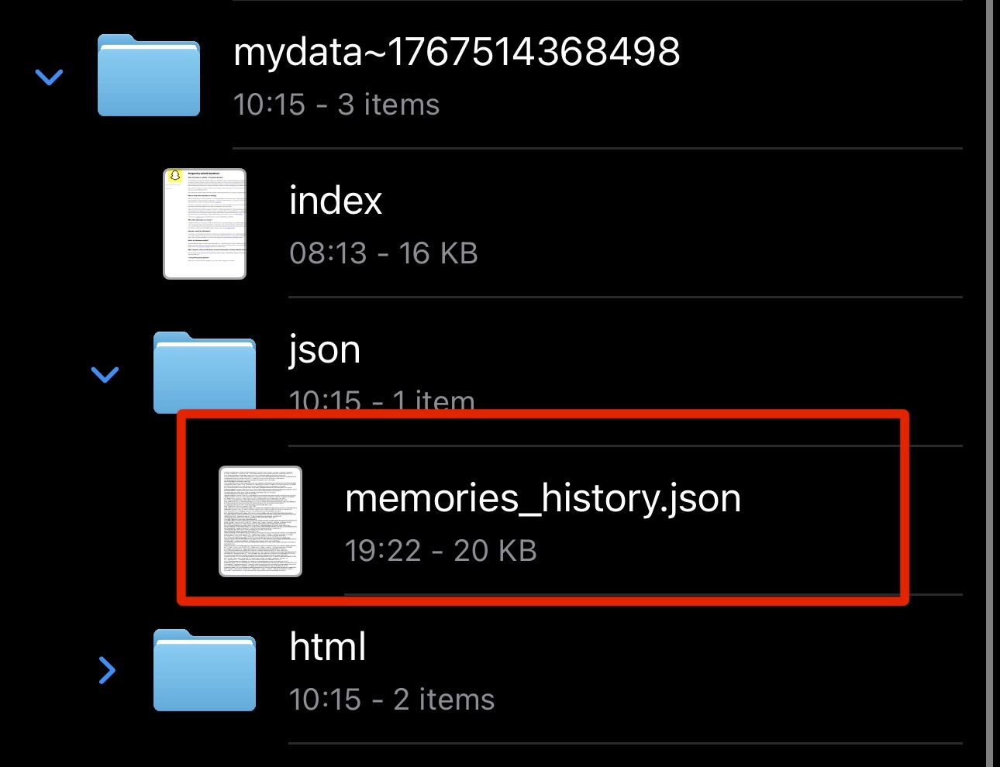

# SnapPack

SnapPack is the ultimate companion app for your Snapchat Memories. It allows you to download, organize, and secure your exported Snapchat data locally on your device, ensuring your memories are always accessible, even offline.

---

## Features

- **Lossless Import**: Recover your photos and videos in their original quality directly from Snapchat's JSON export.
- **Secure Local Storage**: Your media stays on your device—no cloud, no tracking, just your privacy.
- **Chronological Gallery**: Automatically organizes your memories by date, making it easy to relive your favorite moments.
- **Biometric Locker**: Move sensitive memories into a passcode-protected vault for peace of mind.
- **Smart Validation**: Deep media validation ensures only healthy, non-corrupted files are saved.
- **iPad Support**: Optimized layouts for both iPhone and iPad.
- **Multi-language Support**: Full support for English and Arabic (العربية) with RTL layout.

---

## How to Get Started

To use SnapPack, you first need to export your data from Snapchat. Follow these steps:

### Step 1: Request Your Data
Open Snapchat settings, go to **"My Data"**, and request an export. **CRITICAL:** Ensure you select the **JSON** format option.

### Step 2: Extract the File
Snapchat will process your request (usually within 24 hours). Once you receive the email, download the ZIP file to your device and extract it.

### Step 3: Import into SnapPack
1. Open the **Downloader** tab in SnapPack.
2. Tap **"Select Media File"**.
3. Navigate to your extracted folder and locate the file named `memories_history.json`. **This is the file you must select.**

4. Tap **"Start Download"** and wait for the process to complete.

---

## Usage Instructions

### Gallery
- Browse your memories in a beautiful, organized grid.
- Sort by newest, oldest, or by year.
- Select multiple items to share, delete, or move to your protected vault.

### Downloader
- Track your download progress in real-time.
- View successful, pending, and failed (expired) links.
- Use the **"Clean Up"** tool to remove any legacy broken files.

### Locker
- Access your private vault by tapping the shield icon in the Gallery.
- Set a custom passcode to keep your most private memories safe from prying eyes.

---

## Language Support

SnapPack is built for a global audience. You can switch between **English** and **Arabic** at any time from the Onboarding/Tutorial screen using the globe icon in the corner.

---

## Disclaimer

SnapPack is an independent utility and is not affiliated with, endorsed by, or sponsored by Snapchat or Snap Inc. Use this tool in accordance with Snapchat's Terms of Service.

---

## Author

Created by [Amr Mafalani](https://github.com/AfterMath9)
Follow on X: [@iBadDroid](https://x.com/iBadDroid)
